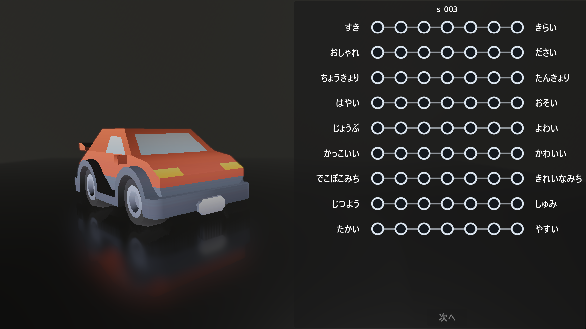
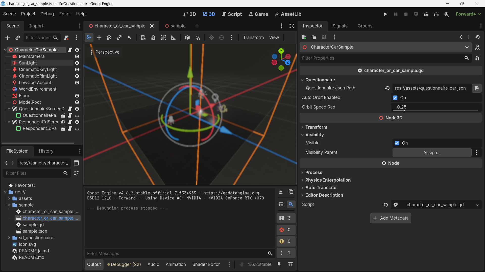

# sd-questionnaire サンプル

GodotでSD法質問紙のデモを実行するためのサンプルプロジェクトです。

## 動作環境

- [Godot 4.6](https://godotengine.org/download/archive/4.6-stable/)で動作確認済みです。

## サンプルの実行

1. Godot Editorでこのプロジェクトを開きます。
2. `Run Project`または`F5`で実行すると、`sample/character_or_car_sample.tscn`が起動します。
3. 回答者IDを入力すると、3DモデルとSD法質問紙が表示されます。
4. すべての刺激に回答すると、回答結果がCSVに出力されます。



## character_or_car_sample.tscn

`sample/character_or_car_sample.tscn`は、キャラクターまたは車の3Dモデルを刺激として表示しながらSD法質問紙に回答するためのサンプルシーンです。初期設定では`assets/questionnaire_car.json`を読み込み、`assets/kenney_car`内の車モデルを順番に表示します。



### 実行時の流れ

1. ルートノードの`CharacterCarSample`が質問紙JSONを読み込みます。
2. `RespondentIdScreenDialog`で回答者IDを入力します。
3. `ModelRoot`の下に現在の刺激モデルが読み込まれ、`QuestionnaireScreenDialog`にSD法質問紙が表示されます。
4. すべての刺激への回答が終わると、回答結果がCSVに出力されます。

### 各ノード

- `CharacterCarSample`: シーン全体を制御するルートノードです。`sample/character_or_car_sample.gd`がアタッチされており、質問紙JSONの読み込み、刺激モデルの切り替え、回答の収集、CSV出力を行います。Inspectorの`Questionnaire Json Path`を`res://assets/questionnaire_character.json`に変更するとキャラクター用の質問紙に切り替えられます。
- `MainCamera`: 刺激モデルを映す3Dカメラです。読み込む質問紙JSONに応じてカメラの高さが調整され、キャラクターと車のどちらも見やすい位置から表示します。
- `SunLight`: シーン全体に方向性のある光を当てる`DirectionalLight3D`です。影の基準となる主な環境光として使われます。
- `CinematicKeyLight`: 刺激モデルの正面側を照らす`SpotLight3D`です。モデルの形や質感を見やすくするためのメインライトです。
- `CinematicRimLight`: モデルの背面側から輪郭を強調する`SpotLight3D`です。背景や床からモデルを分離して見せます。
- `LowCoolAccent`: 補助的な`OmniLight3D`です。モデル周辺にアクセントライトを足して、暗部がつぶれすぎないようにします。
- `WorldEnvironment`: 空、環境光、トーンマッピング、フォグ、SSAO、SDFGIなどの描画設定をまとめたノードです。シーン全体の明るさや雰囲気を決めます。
- `Floor`: 刺激モデルの下に置かれた床用の`MeshInstance3D`です。モデルの接地感を出し、影を受ける面として使われます。
- `ModelRoot`: 実行時に読み込まれたGLBモデルを追加する親ノードです。次の刺激へ進むたびに現在のモデルを削除し、新しいモデルをこの下に配置します。
- `QuestionnaireScreenDialog`: SD法質問紙を画面上に表示する`CanvasLayer`です。`sd_questionnaire/questionnaire_screen_dialog.gd`がアタッチされており、回答送信時にシーンへ結果を渡します。
- `QuestionnairePanel`: 質問文、尺度、送信ボタンを持つ質問紙UIです。`sd_questionnaire/questionnaire_panel.tscn`のインスタンスで、刺激が表示されるまで非表示になっています。
- `RespondentIdScreenDialog`: 回答者ID入力UIを画面上に表示する`CanvasLayer`です。回答開始前に表示され、入力されたIDをCSV出力時に使用します。
- `RespondentIdPanel`: 回答者ID入力欄と送信ボタンを持つUIです。`sd_questionnaire/respondent_id_panel.tscn`のインスタンスで、`RespondentIdScreenDialog`から表示されます。

## sample.tscn

`sample/sample.tscn`をCurrent Sceneにして`Run Current Scene`または`F6`で実行すると、`assets/questionnaire.json`に基づいてSD法質問紙を起動できます。

`sample/sample.tscn`では、`assets`フォルダ直下に配置したGLBファイルを刺激として表示できます。GLBファイルを追加したあと、必要に応じて`assets/questionnaire.json`を編集してください。

## questionnaire.jsonのルール

`assets/questionnaire.json`は、表示する刺激、尺度の点数、形容詞対、ランダム化、CSV出力先を定義します。

```json
{
  "stimuli": [
    {
      "id": "s_001",
      "description": "sample model",
      "file_name": "sample.glb"
    }
  ],
  "load_all_glbs": true,
  "points": 7,
  "adjective_pairs": [
    ["明るい", "暗い"],
    {
      "id": "warm-cold",
      "left": "暖かい",
      "right": "冷たい"
    }
  ],
  "randomise": {
    "stimuli": true,
    "adjective_pairs": true
  },
  "csv_file_name": "questionnaire_results.csv",
  "csv_output_directory": "Desktop"
}
```

### 各項目

- `stimuli`: 刺激として表示するGLBファイルの一覧です。
- `stimuli[].id`: 刺激のIDです。省略した場合は`file_name`の拡張子なしファイル名が使われます。重複はできません。
- `stimuli[].description`: 質問紙に表示する刺激の説明です。省略できます。
- `stimuli[].file_name`: `assets`フォルダからの相対パスです。`sample.glb`や`kenney_car/van.glb`のように指定します。
- `load_all_glbs`: `true`にすると、JSONファイルと同じフォルダ内の未指定GLBファイルも刺激に追加します。`sample/sample.tscn`では`assets`直下のGLBファイルが対象になります。
- `points`: SD法尺度の段階数です。`5`または`7`を指定します。
- `adjective_pairs`: 形容詞対の一覧です。`["左ラベル", "右ラベル"]`形式、または`{"id": "...", "left": "...", "right": "..."}`形式で指定できます。
- `adjective_pairs[].id`: CSVの列名として使われます。省略した場合は`left-right`形式のIDが自動生成されます。重複はできません。
- `randomise.stimuli`: `true`にすると刺激の表示順をランダム化します。
- `randomise.adjective_pairs`: `true`にすると形容詞対の表示順をランダム化します。
- `csv_file_name`: 出力するCSVファイル名です。省略時は`sd_answers.csv`です。
- `csv_output_directory`: CSVの出力先です。`Desktop`、`Downloads`、`Documents`、または`~/Desktop`のような形式を指定できます。省略時は`Desktop`です。

CSVには、`id`、`respondent_id`、`datetime`、`stimulus_id`、各形容詞対の回答値が出力されます。
